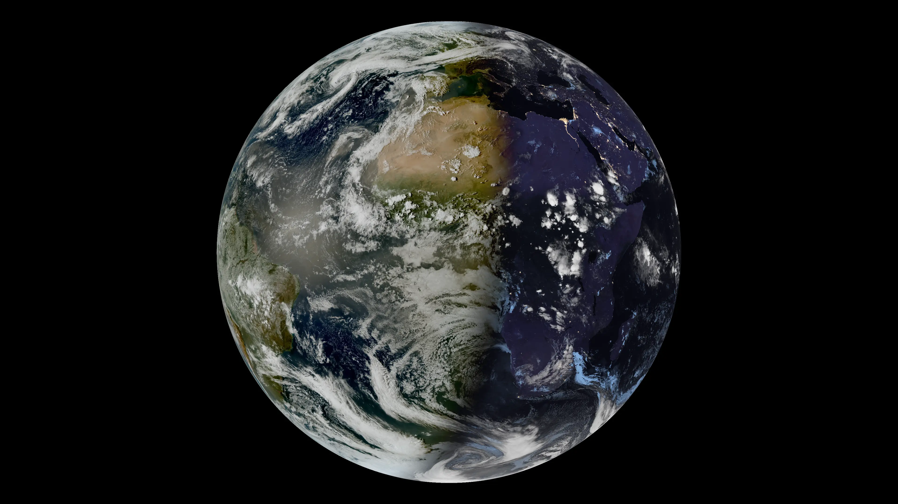
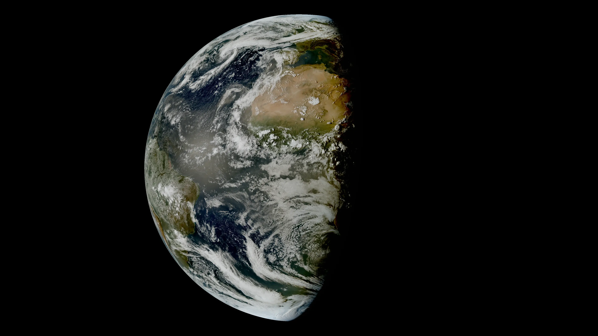
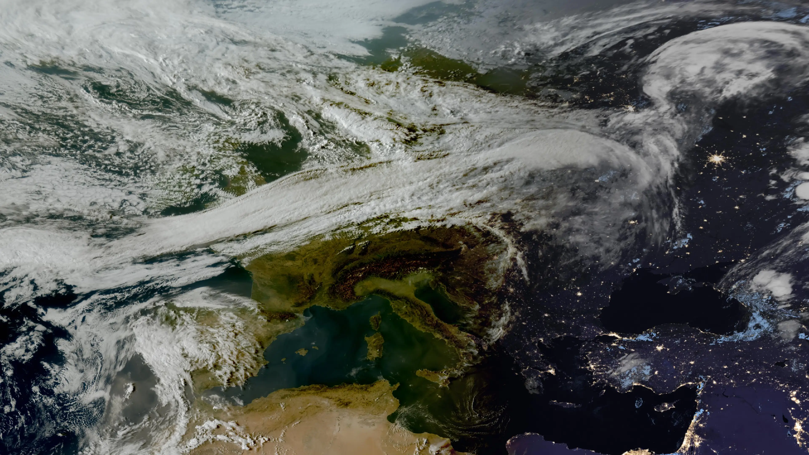
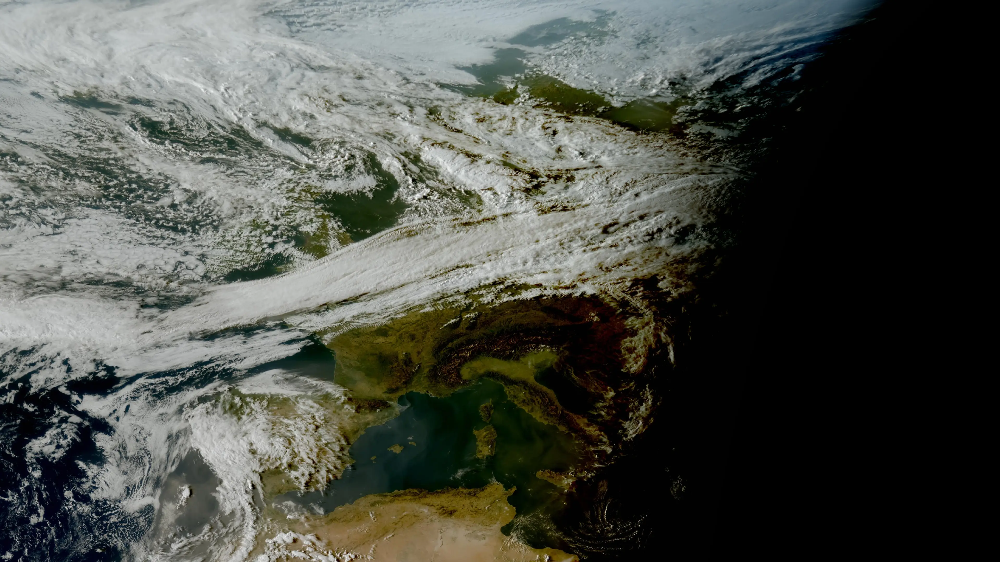

# MarbleScape — Satellite live imagery for your desktop.

> This is an unofficial third-party utility. It is not affiliated with or
> endorsed by EUMETSAT.

<br>

<p align="center">
  
  
</p>

<p align="center">
  
  
</p>

MarbleScape Wallpaper downloads current satellite imagery from the EUMETSAT
EUMETView WMS service, combines optional layers, and can set the result as the
Windows desktop wallpaper. The downloader also runs on Linux, while the tray
menu, startup integration, and automatic wallpaper update are Windows-only.

## Privacy and network access

The application does not contain analytics, telemetry, advertising, accounts,
API keys, or credential collection. It stores configuration and downloaded
images locally.

Network requests are sent only to the WMS endpoint configured in
`marblescape_config.toml`. The default endpoint is:

```text
https://view.eumetsat.int/geoserver/wms
```

Console output may contain local configuration and output paths. Remove or
redact those paths before publishing diagnostic logs.

The Windows menu item `Start with Windows` stores the local launch command in:

```text
HKCU\Software\Microsoft\Windows\CurrentVersion\Run
```

## Run the Windows executable

The prebuilt package supports 64-bit Windows 10 and 11 and does not require a
separate Python installation.

1. Download `MarbleScape-windows-x64.zip` and `SHA256SUMS.txt` from
   [GitHub Releases](https://github.com/Gittegatt/MarbleScape/releases).
2. Extract the complete ZIP archive into a user-writable folder. Do not run the
   application from inside the ZIP archive.
3. Optionally verify the download before starting it:

   ```powershell
   Get-FileHash .\MarbleScape-windows-x64.zip -Algorithm SHA256
   Get-Content .\SHA256SUMS.txt
   ```

   The displayed ZIP hash must match the corresponding line in
   `SHA256SUMS.txt`.
4. Run `marblescape.exe`. The executable is not code-signed, so Windows may show
   an unrecognized-publisher warning. Continue only after obtaining the file
   from a trusted release and verifying its checksum.
5. Find the MarbleScape icon in the Windows notification area. It may be inside
   the overflow menu behind the up-arrow. Right-click the icon and select
   `Settings...` to configure the image.

The tray icon appears immediately. The first wallpaper is applied after the
initial WMS request and image download have completed. Use `Open image folder`
to inspect the generated image, `Start with Windows` to enable per-user
startup, and `Exit` to stop the application.

## Run from source

The tray menu provides `Force loading new picture` directly above the activity
status. While standing by, this requests an immediate download even when the
layer timestamp has not changed. Identical content does not create a duplicate
history image.

Source operation requires:

- Python 3.11 or newer;
- Pillow 10.0 or newer;
- pystray 0.19.5 or newer;
- Windows 10 or 11 for tray and wallpaper integration.

Install the dependencies and start the application:

```powershell
python -m pip install -r requirements.txt
python marblescape_download.py
```

If `marblescape_config.toml` is missing, the application automatically creates it
from a legacy `earthscape_config.toml`, `satscape_config.toml`, or
`eumetview_config.toml` (in that order) if available, otherwise from the neutral
`marblescape_config.example.toml` template. On Windows,
`start.bat` performs the same source-based start and keeps a console window open
for messages.

Useful command-line options:

```powershell
python marblescape_download.py --list-layers geo
python marblescape_download.py --export-layers marblescape_layers.json
python marblescape_download.py --validate-config
python marblescape_download.py --print-urls
python marblescape_download.py --once
python marblescape_download.py --version
```

## Linux usage

Linux supports image downloading and local composition, but not the Windows
tray menu, Windows startup integration, or automatic wallpaper application.

```bash
python3 -m pip install -r requirements.txt
python3 marblescape_download.py --once
```

Remove `--once` to keep checking for new imagery until the process is stopped.
The output location is controlled by `linux_root` in
`marblescape_config.toml`.

## Windows tray menu

During normal continuous operation, a MarbleScape icon appears in the Windows system tray area. Its menu provides access to:

- the current image folder;
- the settings dialog for common image, wallpaper and history options;
- a forced image refresh and current activity status;
- per-user Windows startup;
- restart and exit.

`Open image folder` appears directly above `Settings...` in the first menu
section. Changes made in Settings are written to the active local TOML file and
applied by the running application without restarting it. A new image is
requested when required. Double-clicking the tray icon opens Settings.
Diagnostic and one-shot commands do not show a tray icon. `Restart` remains
available for troubleshooting.

The lower menu shows `Checking for new image...`, `Fetching new image...`,
or `Standing by...`, followed by `Next check` in local time.
`Start with Windows` is in the bottom section above `Restart`.

In Settings, the read-only `Status and storage` section displays the current
image size, latest image count, estimated history count, maximum total image
count, estimated storage, current latest/history image-file usage, and next
check time. Usage is shown in MB, switching to GB at 1,000 MB. Estimates use
the saved, active configuration and current image size; unsaved edits do not
affect them. Time-based retention estimates assume a new image each cycle.

Settings is organized into four tabs:

- **General:** Preset, Wallpaper, and Updates (including Force loading new picture).
- **Image:** View, Projection, and Output.
- **History & Storage:** History configuration and current storage status.
- **Backup:** JSON import and export.

The resizable window opens centered at approximately 800 x 700 logical pixels,
adjusted for Windows scaling and the available desktop work area. Each tab
scrolls vertically when needed, using its scrollbar or the mouse wheel.
Keyboard navigation reveals focused settings automatically. Activity status,
the single-line **Next check** timestamp, and **Apply / OK / Cancel** stay
visible outside the scrolling area. The timestamp has reserved width to avoid
moving the buttons when its value changes.

The Image tab provides resolution and aspect-ratio presets.
Selecting a preset fills the editable width, height, and ratio
fields; choose `Custom` or edit those fields directly for another size.

View presets have their own section in the General tab. Selecting one fills its
satellite layer, projection, fit mode, and zoom defaults; individual values can
then be adjusted. **Apply** saves and activates changes while keeping Settings
open, **OK** applies and closes the window, and **Cancel** discards changes made
since the last Apply.

### Settings backups

Use the Backup tab in `Settings...` to create a JSON backup.
The backup contains the complete active
TOML configuration, a readable settings snapshot, an integrity checksum, and
the current per-user Windows startup state.

Import validates the JSON structure, checksum, and embedded TOML before
replacing and applying the active configuration. A confirmation is required.
Absolute output paths stored in a backup may need adjustment when restoring it
on another computer.

## Known imagery artifacts

During twilight or nighttime, `MTG GeoColor` may occasionally contain hard
rectangular seams, missing tiles, or image segments that appear to overlap.
GeoColor combines daytime TrueColor imagery with a nighttime infrared cloud
visualisation over the static NASA Black Marble background. The transition and
upstream WMS mosaicking can make a temporarily inconsistent source segment
particularly noticeable.

MarbleScape does not divide the requested area into local download tiles.
It either requests a combined WMS image or downloads full-area images for
local composition, including a separate mask for the TrueColor night option.
Seams can originate in upstream imagery, but a screenshot alone does not rule
out a composition or display issue. Compare the generated PNG with the desktop
and, if needed, the individual URLs from `--print-urls`. If an artifact persists,
keep the generated image and its
timestamp, try an earlier available timestamp or another satellite layer, and
report the example to the EUMETSAT User Service Helpdesk.

For background information, see the official
[MTG GeoColor product description](https://user.eumetsat.int/catalogue/EO%3AEUM%3ADAT%3A0913)
and the [EUMETView release changelog](https://user.eumetsat.int/resources/user-guides/eumet-view-release-changelog).

## Configuration

MarbleScape was previously named EUMETView Wallpaper. Existing settings backups
and history images remain supported. On its first normal Windows launch,
MarbleScape updates a recognized legacy autostart entry for this installation
when it points into the same application folder. If you move the folder,
disable the old Windows startup entry and enable `Start with Windows` again
from the new location. Existing shortcuts must also point to the new EXE.
EUMETView is the name of EUMETSAT's data service; MarbleScape is an independent
application and is not an official EUMETSAT product.

In Settings, use `Custom latest folder` under Output or `Custom history folder`
under History to type a path or select one with `Choose...`. Empty fields use
the latest/history directories under the configured output root. Relative
paths use the application folder. Apply or OK applies the paths; missing
folders are created when needed (history only when enabled). Existing images
are not moved. Latest and history must use different directories.

These paths are saved as `output.latest_folder` and `history.folder` and are
included in settings backups. `Open image folder` opens the active latest folder.

All user settings are stored in `marblescape_config.toml`. The repository ignores
that local file so personal preferences are not accidentally published. The
tracked `marblescape_config.example.toml` contains neutral defaults.

Advanced options still require editing TOML: the service endpoint and timeout,
archive timestamps, arbitrary layer stacks/styles/opacities, custom bounding
boxes, and output-root paths. Restart after manual file edits. Backup import
applies a complete configuration, including these advanced options.

Relative output paths are resolved from the application directory, regardless
of the current working directory:

```toml
[output]
windows_root = "."                         # Application directory
# Alternatives (choose one value for windows_root):
# windows_root = "output"                  # An output subdirectory
# windows_root = 'D:\Images\MarbleScape'     # A custom absolute path
linux_root = "."
```

For a container, set `linux_root = "/output"` and mount that directory as a
volume.

When `height = 0`, the output height is calculated from `width` and
`aspect_ratio`.

### Render quality

`Output > Render quality` provides:

- `Auto (max useful)` (default)
- `Standard (1.0×)`
- `High (1.25×)`
- `Very high (1.5×)`
- `Ultra (2.0×)`
- a custom factor of at least `1.0`

The final output resolution does not change. Higher settings request a larger
intermediate WMS image and resize it with Lanczos resampling. WMS requests are
capped at approximately 4000 pixels per axis. Outputs above that limit are
rendered proportionally within the service limit and then enlarged to the
selected size, so a quality factor above `1.0` adds no detail at 5K or 8K.
`Auto (max useful)` persists as an automatic mode and recalculates the largest
useful factor whenever the output resolution changes.
Pillow is required whenever the WMS render size differs from the final output.

### TrueColor day/night option

`Black TrueColor night side` applies only to `MTG TrueColor`. It displays
the sunlit portion of the satellite image and fills the unlit part of the Earth
disk with black. The area outside the disk retains the configured background
color.

### Layers

Local composition and the Full Earth server path use the configured layer
order from bottom to top. The current regional server path reverses this
order for compatibility with its existing rendering behavior; therefore
arbitrary stacks can look different when changing render mode or preset.
Friendly basemap and overlay names are
resolved by the application. Exact WMS product names can be discovered from the
live capabilities document:

```powershell
python marblescape_download.py --list-layers
python marblescape_download.py --export-layers marblescape_layers.json
```

Each `[[layers]]` entry supports `enabled`, `opacity`, `style`, and an
optional `time`. In `render_mode = "auto"`, a single server request is used
unless per-layer opacity or different timestamps require local composition.
The TrueColor black-night option also uses local composition with a separate
Earth mask, regardless of the selected render mode.

### Projections

Select a projection in the **View** section of **Settings**, or using
`view.projection` in the configuration. By default, Settings shows Geographic
and two GEOS projections:

- `Geographic` (EPSG:4326)
- `GEOS: MSG FES, MTG FD` (geostationary, centered at 0 degrees)
- `GEOS: MSG RSS` (geostationary, centered at 9.5 degrees east)

Check **Show extended projections**, directly below **Black TrueColor
night side**, to also show:

- `GEOS: MSG IODC` (geostationary, centered at 41.5 degrees east)
- `Spherical Mercator` (EPSG:3857)
- `North Polar` (EPSG:3995)
- `South Polar` (EPSG:3976)

GEOS: MSG IODC is currently grouped under extended projections because of
coverage limitations when combined with MTG layers. The projection itself is
not experimental. Areas outside the layer's image coverage may display the
basemap instead of satellite imagery. The short Settings hint reads:
"Coverage depends on the selected satellite layer."

Definitions follow the [EUMETSAT viewer configuration](https://view.eumetsat.int/assets/data/config.json).
The checkbox is saved as `view.show_extended_projections` (default
`false`) and included in JSON backups. Unchecking it while an extended
projection is selected resets the draft view to GEOS at 0 degrees / Full Earth.
Use **Apply** or **OK** to save; **Cancel** discards these changes. Older
configurations and JSON backups using `view.unlock_experimental_projections`
remain supported; the new key takes precedence when both are present. Settings
saves use the new key. Configurations without either setting retain an already
selected extended projection and open with the checkbox checked. If the setting
is explicitly `false`, selecting any extended projection in TOML also requires
setting it to `true`.

Changing projection in the UI selects `full_earth`, resets zoom to `1.1`, and
uses `fit` (`crop` for Geographic, to stay within valid latitude/longitude
bounds). Here, Full Earth means the projection's default overview, not a
guarantee of global satellite coverage. The selected satellite layer is kept.
Settings are saved in the active TOML file and included in JSON backups.

Existing regional presets still use Geographic; projected regional presets
are not included yet. For a custom projected view, specify `bbox` in meters
in the selected CRS. Geographic uses degrees. A projection cannot add missing
satellite coverage: some regions, especially the poles, may be blank with MTG.
Choose a layer that covers the area you want to display.
South Polar uses the Antarctic CRS EPSG:3976, not the Arctic EPSG:3995.
With MTG imagery, a black center and imagery only towards the edge can be
expected in polar views: the satellite does not observe the poles. In
particular, black-night masking also hides the underlying basemap. Selecting
a projection does not generate imagery for these missing areas.

### View presets

Available presets are:

- `full_earth`
- `europe`
- `mediterranean`
- `central_europe`
- `custom`

For `custom`, define `bbox` in logical x/y order. With the geographic
projection, use `[west, south, east, north]`. WMS 1.3.0 axis order is
handled automatically.

The default zoom is `1.1`, including all named preset profiles and projection
changes. An explicitly saved custom zoom is still respected.

## Planned features

- Support for additional satellite imagery providers.
- More customization options for image composition.

These ideas are planned, but scope and release dates may change.

## Building release archives

This step is intended for maintainers, not for users of the prebuilt package.
On 64-bit Windows with 64-bit x86 Python, install the tested build dependencies
and run the release script:

```powershell
python -m pip install -r requirements-build.txt
powershell -ExecutionPolicy Bypass -File .\build_release.ps1
```

The script creates separate source and Windows archives in `release`, plus a
SHA-256 checksum file. Local configuration, shortcuts, downloaded images,
caches, and unused local assets are never copied.

The build regenerates `assets/icons/marblescape.ico` from the supplied PNGs
using `build_icon.py`. The ICO contains the original 16, 32, 48, 64, 128 and
256 px images; the tray can additionally use the 512 px PNG. Keep these
assets alongside the source when building. The EXE embeds its icon and tray
assets, so no separate icon installation is needed.

`app_version.py` defines the application version used by `--version`, the
HTTP User-Agent, and the EXE's Windows file/product version metadata.
The build generates that metadata with `build_windows_version.py`.

The executable is inside `MarbleScape-windows-x64.zip`; extract that archive
to use the new build. Building does not replace an already running installation.

The updated build script includes the matching application source ZIP under
`source/` inside the Windows package and the verified upstream pystray source
under `third_party/` in both packages. See
[Third-Party Notices](THIRD_PARTY_NOTICES.md#rebuilding-with-a-modified-pystray)
for rebuilding with a modified tray library. Existing archives must be rebuilt
to contain these materials; previous releases are not updated retroactively.

The Windows executable is not code-signed. Windows may therefore display an
unrecognized-publisher warning.

## EUMETSAT data and branding

The README includes example satellite images under `assets/examples`.
Imagery credit: EUMETSAT (MTG GeoColor/TrueColor), processed by MarbleScape
for framing, composition, resizing and WebP display. Additional contributors
and layer-specific terms may apply. The application license does not relicense
these images.
Live downloaded imagery is not included in releases. Users
must verify the licence and attribution requirements for every selected layer.
See the official EUMETSAT data registration and licensing guide and terms of
use:

- https://user.eumetsat.int/resources/user-guides/data-registration-and-licensing
- https://www.eumetsat.int/about-us/terms-use

Do not package or reuse the EUMETSAT logo or corporate visual identity without
the required permission. This project intentionally ships without an EUMETSAT
logo.

## Credits and attribution

The application and tray icon are based on
[Shape sphere](https://icon-icons.com/icon/shape-sphere/120489) by
[Zwoelf](https://icon-icons.com/authors/728-zwoelf)
([www.zwoelf.hu](https://www.zwoelf.hu/)), from the Zwicon set.
Icon-icons lists the [pack](https://icon-icons.com/pack/zwicon/1875) as
"Free for commercial use". The creator's
[usage instructions](https://www.zwicon.com/how-to-use.html) specify
[CC BY-ND 4.0](https://creativecommons.org/licenses/by-nd/4.0/): commercial use
with attribution is allowed, but distributing adapted artwork is not.
This corrects the earlier, overly permissive CC BY 4.0 attribution.

For MarbleScape, the artwork is distributed as size-specific PNG assets and
packaged into a multi-resolution Windows ICO. Credit does not imply the
creator's endorsement. The icon retains its separate CC BY-ND 4.0 terms; the
application's noncommercial restrictions do not apply to this third-party icon.
The maintainer recolored the icon turquoise using the built-in SVG editor
opened through **Edit icon** on icon-icons.com, for noncommercial use in
MarbleScape. This records the modification and its origin, not a separate
permission from the creator. Technical format conversion is allowed by
license section 2(a)(4); permission to redistribute the recolored variant
has not been established. Noncommercial use does not waive the NoDerivatives
condition, including when sharing the icon in a public repository or executable.
See [Third-Party Notices](THIRD_PARTY_NOTICES.md) and the bundled
[`licenses`](licenses) directory for dependency notices.

## License

MarbleScape is source-available under the
[PolyForm Noncommercial License 1.0.0](https://polyformproject.org/licenses/noncommercial/1.0.0).
The complete terms are included in [`LICENSE`](LICENSE).

Required Notice: Copyright 2026 Gittegatt

Noncommercial uses and the other permitted purposes defined in `LICENSE` are
allowed subject to its terms. Uses outside those permissions require separate
authorization from the copyright holder, except where statutory rights apply.
This is a general noncommercial license, not merely an AI-training restriction,
and it is not an OSI-approved open-source license. Third-party components
remain subject to their respective licenses.

### Outstanding distribution review

Before publishing a new binary release, clarify permission for any artistic
changes to the icon and review the example images' layer terms. Also resolve
whether the application's noncommercial terms preserve the library modification
and recombination rights required by pystray's LGPL. Source and rebuild
materials alone do not settle that licensing question. See
[Third-Party Notices](THIRD_PARTY_NOTICES.md#outstanding-licensing-review).
No additional permission or licensing exception is granted by this review.

## AI Notice

AI-assisted coding tools were used during the development of this project.

AI or machine-learning training, fine-tuning, dataset creation, and model
improvement are subject to the same PolyForm Noncommercial terms as other
uses of this source code. Commercial purposes outside the license's permitted
purposes require separate authorization. This notice adds no restrictions to
third-party material and does not override statutory exceptions.

## ☕ Support the project

If you enjoy the project and would like to support its development, a small contribution is always appreciated.

[](https://ko-fi.com/gittegatt)

## ✉️ Contact

For project information and commercial licensing inquiries, visit the
[MarbleScape repository](https://github.com/Gittegatt/MarbleScape).
