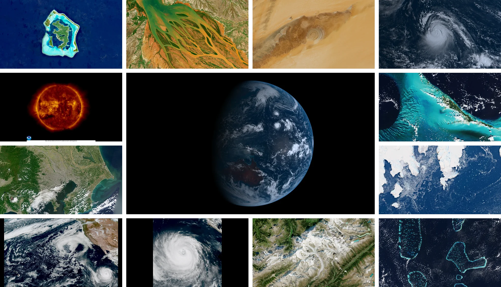

# MarbleScape - Real-Time Satellite Imagery for your desktop.

> MarbleScape is an unofficial third-party utility. It is not affiliated with or
> endorsed by EUMETSAT, NOAA, NICT, JMA, CIRA/CSU, NASA, or the Copernicus Data Space Ecosystem.

<p align="center"><a href="assets/examples/marblescape-examples.webp"></a></p>

<sub>Pictures made with MarbleScape, from the top left: Bora-Bora, Betsiboka Estuary, Guelb er Richat
(Copernicus); Typhoon Koguma (Himawari, NICT); the Sun (NOAA SUVI); Himawari full disk (NICT, centre); Great
Exuma, Tokyo, Western Greenland (Copernicus); Hurricane Rachel (GOES-18 West CONUS and mesoscale, CIRA
SLIDER); Aletsch Glacier, Ari Atoll (Copernicus).
Credits: [Example images](docs/LEGAL_AND_ATTRIBUTION.md#example-images).
Single pictures at 1600 × 900: [assets/examples](assets/examples).</sub>

MarbleScape downloads current satellite imagery and prepares it as a desktop
wallpaper. It supports EUMETSAT, NOAA GOES and Solar/SUVI, Himawari, CIRA
SLIDER, NASA Worldview/GIBS, and the Copernicus Data Space. The Windows version
includes a system tray menu, automatic wallpaper updates, image profiles,
profile rotation, history, and local caching. The downloader also runs on Linux.

The pictures come straight from weather and Earth observation satellites, not
from a map service such as Google Maps: weather satellites show whole continents
at about 0.5-3 km per pixel, every few minutes. See
[What the image sources show](docs/IMAGE_SOURCES.md#what-the-image-sources-show).

## Why MarbleScape?

I love satellite images. Looking at the world from above never gets boring for me.
That's also why I spend a lot of time in Microsoft Flight Simulator: for me it's less
about the flying itself and more about seeing real places and landscapes from above.
I could also spend hours browsing Google Maps, looking at places I know and places I
have never been to.

What always bothered me: the pictures in Google Maps are often old, sometimes by
months, sometimes by years. You never really know what a place looks like right now.

So for a very long time I had the idea of building something that shows me what
certain places look like today: in real time, or at least as current as possible.
Clouds, snow, the changing seasons, simply the way things are.

A desktop wallpaper, on the other hand, is usually static. Even a beautiful landscape
photo is always the same picture, and after a while you stop noticing it. I wanted to
fill it with real life instead.

MarbleScape is what came out of it. It downloads current satellite images and sets
them as my desktop wallpaper. Every time I look at my screen, I see the Earth as it is
today, and it becomes more than just a background image.

## What Copernicus imagery is (and is not)

Copernicus Browser imagery comes from the European Copernicus satellites
(Sentinel-1, -2, -3 and -5P) and Landsat. Sentinel-2, the usual choice for
natural color, sees about **10 m per pixel**: landscapes, fields, forests,
towns, rivers and coasts. It is **not Google Maps**: single houses, cars or
street detail are not visible, and a map zoom beyond about 13-14 only enlarges
the picture. Google Maps assembles aerial photographs and commercial satellite
images down to a few decimetres per pixel, often months to years old.

In return Copernicus imagery is:

- **Current:** days old instead of months to years; the same place again every
  2-5 days, so seasons, floods, fires and snow become visible.
- **Recent throughout:** even a picture made of several acquisitions spans days or
  weeks (a quarter for mosaics), not a patchwork from different years.
- **Worldwide:** including remote areas, with cloud-free quarterly and monthly
  mosaics as well.
- **More than color:** infrared, vegetation, snow, fire and Sentinel-1 radar,
  which sees through clouds and at night.
- **Open data:** free to use with attribution.

The other side: a picture can be made of several parts. A place at the edge of a
satellite pass, or **Gap fill** filling missing areas from earlier days, puts
acquisitions side by side, and their seams, different light or clouds can show.

### It's not always pretty, but it's new.

## Main features

- Current satellite imagery from seven source groups.
- Natural-color or GeoColor defaults where the provider offers them.
- Source-specific satellite, mission, area, layer, projection, date, and resolution controls.
- Automatic source-resolution selection based on connected displays when using multiple monitors.
- Named image profiles with configurable rotation. Profiles hold only Image settings;
  output size, background color and the Latest folder stay device settings.
- Profile-name type-ahead selection in the focused table; persistent sortable, movable and toggleable columns.
- Per-profile Copernicus **No-data color**, transparency, **Blur** or **Edge Blur** for areas without image data, stored in PNG/EXIF; **Labels** and **Country borders** as separate map overlays with their own colors.
- Copernicus saved-PNG size selection (**Auto** through **8K**, landscape or portrait for a vertical view), brightness and contrast correction with independent auto checkboxes and tone rules tuned per Copernicus collection and layer; changed profile settings show "(modified)" until reverted or explicitly updated.
- Protected **Latest snapshot (no profile)** for reusing the last profile-free image settings.
- Data coverage in the Copernicus source-status line, profile details/table and PNG/EXIF (reliable Copernicus data masks; otherwise "Not available").
- Copernicus **Recommendation**: compare cloud limits and **Gap fill** (or a mosaic's periods) for the view with previews and a **Precise check**, or let every image check take the recommendation with **Use auto recommendation**.
- Validated PNG/JSON profile import, one-file-per-profile export, and stable profile IDs.
- Embedded PNG text/EXIF provenance with portable profile settings.
- Latest-image storage, optional history, retention limits, and a profile cache.
- Friendly update-check intervals in minutes, hours, days, weeks, or 30-day months.
- Download and catalogue retries with progress, speed, size, and cancellation controls; daily local-time catalogue refresh with missed-run recovery.
- System-time or UTC timestamp display.
- Light and dark Settings windows (Sun Valley theme), fixed or following the Windows app mode.
- JSON backup and restore for configuration and profiles.
- Windows tray operation, single-instance startup, and per-monitor wallpaper placement.
- An update notice for new public GitHub releases at manual startup or from About, with a per-version skip option.

Satellite observations are not seamless photographic maps. Depending on the
provider and acquisition, imagery can contain clouds, scan seams, missing
coverage, day/night transitions, compression artifacts, or temporarily
inconsistent segments. See [Satellite imagery artifacts](docs/IMAGERY_ARTIFACTS.md).

## Quick start on Windows

A reviewed prebuilt package supports 64-bit Windows 10 and 11.

1. Download the versioned Windows archive (for example,
   `MarbleScape-1.0.0-windows-x64.zip`) and `SHA256SUMS.txt` from
   [GitHub Releases](https://github.com/Gittegatt/MarbleScape/releases).
2. Verify the archive checksum and extract the complete ZIP to a user-writable folder.
3. Run `marblescape.exe`.
4. Settings opens automatically on a manual launch. You can reopen it from the
   notification-area menu or by double-clicking the tray icon. Windows autostart
   stays silent in the tray.
5. Choose an image source, review the output settings, and select **Apply Image** on the **Image** tab.

Tray **Exit** cancels active image transfers and catalogue refreshes, including
pending connections and reads. **Restart** uses the same shutdown path and activates
the new instance once the old instance has released its single-instance lock. Both
are also under **General** > **Actions**, next to **Show log**, which opens
`content/marblescape.log`.

The executable is not code-signed, so Windows may show an
unrecognized-publisher warning. Obtain it from a trusted release and verify its
checksum before continuing. Full instructions are in
[Installation and startup](docs/INSTALLATION.md).

## Run from source

MarbleScape requires Python 3.11 or newer and the packages listed in
`requirements.txt`.

```powershell
python -m pip install -r requirements.txt
python marblescape_download.py
```

Linux supports downloading and local composition without the Windows tray,
startup integration, or automatic wallpaper application:

```bash
python3 -m pip install -r requirements.txt
python3 marblescape_download.py --once
```

See [Installation and startup](docs/INSTALLATION.md) for command-line options,
continuous Linux operation, and tray-menu behavior.

## Getting good pictures

A condensed, sectioned version of this guidance is available inside MarbleScape
under **Info**.

1. Open the original viewer from MarbleScape's **Sources** tab.
2. Explore its satellite, mission, product, layer, projection, area, and date controls.
3. Transfer the useful choices to MarbleScape and configure **General** > **Monitor output** for your monitor. Copernicus **Image resolution** is selected separately under **Image** > **Rendering**; **Auto** covers connected monitor requirements.
4. Select **Apply Image**, inspect the wallpaper, and refine the framing if needed.
5. Save the finished Image settings as a profile under **Profiles**.

For cleaner edges and finer detail, choose a source resolution one available
size above the required output when bandwidth and provider limits allow it.
**Automatic** remains the efficient starting point. Provider websites and
MarbleScape may use different labels or expose different subsets of the same
catalogue, so compare the actual geographic result when matching settings.
Copernicus map overlays, **Labels** (place names, road names and POIs) and **Country
borders**, can be switched on separately with their own colors, as in Copernicus
Browser, and also apply to the Sentinel-1 and Sentinel-2 mosaic products. A cloudless mosaic can still
contain transparent No Data pixels, residual clouds, snow, bright-terrain
artifacts, or source-tile seams; transparent pixels reveal the map background.

## Image sources

| Source | Recommended use | Account required |
| --- | --- | --- |
| EUMETSAT | Europe, Africa, Atlantic, weather products, and multiple projections | No |
| NOAA GOES | Frequent full-disk and regional imagery for the Americas | No |
| Solar / Sun (SUVI) | Solar ultraviolet channels | No |
| Himawari | Asia-Pacific full-disk and regional imagery | No |
| CIRA SLIDER | Clean satellite products from several geostationary platforms | No |
| NASA Worldview | Global Earth imagery and broad scientific layer selection | No |
| Copernicus Browser | High-resolution regional Sentinel and Landsat imagery | Free OAuth client |

EUMETSAT offers Full Earth, Europe, Mediterranean, and Central Europe presets,
plus **Custom area** for your own region: enter its centre as **Latitude** and
**Longitude** in decimal degrees and set its size with **Zoom** in **Image** > **Source**.
**Image** > **Find location** looks up a place by name and fills **Latitude** and
**Longitude** for Copernicus and a **Custom area**.

Still-image sources default to GeoColor, GeoColour, natural color, or true color
where available. Solar uses a wavelength channel because natural color does not
apply to the Sun. Copernicus rendering requires a free Sentinel Hub OAuth client
from the Copernicus Data Space account settings.
New Copernicus settings select **Sentinel-2 Mosaics**, **Sentinel-2 Quarterly Mosaics**,
and **True Color Cloudless**. Saved selections stay as configured.
**Quarter selection** offers **Specific quarter**, **Relative to now**, and
**Latest available**. Relative targets use **Quarters back** (current quarter or
1-40 quarters ago). Sentinel-1 monthly mosaics have the corresponding **Month
selection** and **Months back** controls (current month or 1-120 months ago).
Unpublished target periods are reported, never silently replaced.

Provider-specific satellites, missions, layers, projections, Gap fill modes,
cloud filtering, brightness correction, lookback behavior, and selection matrices are documented in
[Image source guide](docs/IMAGE_SOURCES.md).

## Settings overview

Settings contains these tabs:

- **General** - Wallpaper, display time zone, update timing, output device, and output size.
- **Downloads & Updates** - Image update checks (interval, next check), transfer display, download retries, catalogue refresh with its daily schedule, and catalogue retries.
- **Image** - Source selection, catalogue refresh for the selected source, image updates, and framing.
- **Profiles** - Saved Image configurations and rotation timing.
- **History & Storage** - Latest folder, one shared History folder, separate no-profile/profile History with per-profile local retention, cache, and storage status.
- **Backup** - JSON import/export of settings only or settings and all profiles.
- **Sources** - Links to the original satellite imagery viewers.
- **Info** - Short sections covering workflow, imagery, monitor output and framing,
  mosaics, profiles and transfers, PNG metadata, downloads and catalogues, backups,
  exit behavior, and **Save**/**Apply Image**. Explanations of individual settings live here.
- **About** - Separate sections for the application, project and updates,
  privacy and local data, license and credits, and help and support.

**About** > **Support this project** and the tray's **Support this project** open the same
small dialog with GitHub Star, Ko-fi and PayPal links. It is centered
over Settings when Settings is open, otherwise on the screen. A website opens
only when its link is selected.

Settings changes remain drafts until **Save**, **Apply Image**, or **OK**.
The exception is **Profiles**: adding, updating, renaming, deleting,
moving and importing profiles, rotation settings, the table view and its History
checkboxes are saved immediately after any confirmation.
On **Image**, **Apply Image** saves only Image-tab choices and reloads the image when
those choices changed; **Save** right of it saves them without loading a new image now
(they apply at the next regular image check). On every other tab, **Save** saves non-Image settings
without starting a new image load;
it is greyed out while nothing is waiting to be saved.
**OK** saves the complete dialog and closes it. The footer keeps
activity, next-check time, download progress, the save notice ("Unsaved changes",
"✓ Saved") and the main action buttons visible while individual tabs scroll. **Close** discards unapplied changes;
**Cancel download** remains a separate transfer-control button.

The detailed control reference, storage behavior, custom folders, advanced
TOML settings, render quality, presets, and backup format are in the
[User guide](docs/USER_GUIDE.md).

New PNG images contain a compact MarbleScape provenance record in PNG text and EXIF: source,
selection, image time or mosaic period, and applicable location, saved-profile
name and UUID, plus portable settings for importing the image as a profile. It contains
no OAuth credentials, tokens, or local file paths. Profile
names and coordinates can still be private; inspect images before sharing them.
Older images are not modified. See [PNG metadata and ExifTool](docs/PNG_METADATA.md)
for field meanings and read-only commands, and
[Privacy and network access](docs/PRIVACY_AND_NETWORK.md) before sharing.

## Image profiles and rotation

Profiles preserve the complete Image configuration. Selected profiles can take
part in rotation, while **Latest snapshot (no profile)** safely retains the most
recent successful profile-free setup. The Image header names the profile with
its short ID; changed settings are marked "(modified)" until they are reverted or
explicitly updated.

The **Rotation** checkbox and the context-menu action **Toggle rotation** change
rotation membership for one or several selected profiles. New, duplicated and
newly imported profiles start excluded from rotation. Rotation uses the
same value/unit time input as update checks, optionally shuffles complete passes,
and can resume its locally saved position after restart.

The profile table supports configurable, sortable and movable columns, keyboard
name search, multi-selection, duplication, renaming, deletion, per-profile
history and JSON/PNG import or export. Table layout and sorting are persistent;
the separate **Status** and **History** columns, rotation membership and History policy remain
local application settings and are not exported.
Imports are validated before changes are accepted, and portable profile data is
stored in profile JSON as well as PNG text/EXIF metadata.

Data coverage describes the valid satellite-pixel share - not cloud cover or
download progress. Copernicus results expose it in status/profile views and PNG
metadata where a reliable mask is available.

See the [complete profiles and rotation guide](docs/USER_GUIDE.md#image-profiles-and-rotation),
[Latest snapshot rules](docs/USER_GUIDE.md#latest-snapshot-no-profile), and
[PNG metadata documentation](docs/PNG_METADATA.md) for table controls, UUID and
conflict handling, History layout, filenames, validation and backup behavior.

## Privacy and network access

MarbleScape contains no analytics, telemetry, advertising, or built-in API
keys. Configuration, downloaded images, history, and caches are stored locally.
It contacts the selected imagery providers and may refresh public catalogue
metadata in the background. Copernicus credentials are used only for direct
Copernicus Data Space requests; on Windows the saved Client secret is protected
for the current user with DPAPI.

The complete endpoint list, catalogue behavior, OAuth and quota information,
and Windows startup registration details are in
[Privacy and network access](docs/PRIVACY_AND_NETWORK.md).

## Documentation

- [Installation and startup](docs/INSTALLATION.md)
- [User guide](docs/USER_GUIDE.md)
- [Image source guide](docs/IMAGE_SOURCES.md)
- [PNG metadata and ExifTool](docs/PNG_METADATA.md)
- [Privacy and network access](docs/PRIVACY_AND_NETWORK.md)
- [Satellite imagery artifacts](docs/IMAGERY_ARTIFACTS.md)
- [Development and release builds](docs/DEVELOPMENT.md)
- [Data terms, attribution, and license](docs/LEGAL_AND_ATTRIBUTION.md)
- [Third-party notices](THIRD_PARTY_NOTICES.md)

## Support the project

[Star MarbleScape on GitHub](https://github.com/Gittegatt/MarbleScape)

[Support MarbleScape on Ko-fi](https://ko-fi.com/gittegatt)

[Support MarbleScape with PayPal](https://paypal.me/gittegatt)

## License and contact

MarbleScape is source-available under the
[PolyForm Noncommercial License 1.0.0](LICENSE). Required Notice: Copyright 2026
Gittegatt. Third-party components and imagery remain subject to their own terms.
See [Data terms, attribution, and license](docs/LEGAL_AND_ATTRIBUTION.md) before
publishing a binary or redistributing included visual material.

For project information and commercial licensing inquiries, visit the
[MarbleScape repository](https://github.com/Gittegatt/MarbleScape).

## AI Notice

AI-assisted coding tools were used during the development of this project.

The copyright holder expressly reserves the right to use this repository for text
and data mining, including training, fine-tuning or evaluating AI or
machine-learning models and creating datasets (Article 4(3) of Directive (EU)
2019/790). Such use requires prior written permission. Commercial use of
MarbleScape is not permitted by its [license](LICENSE) either.
